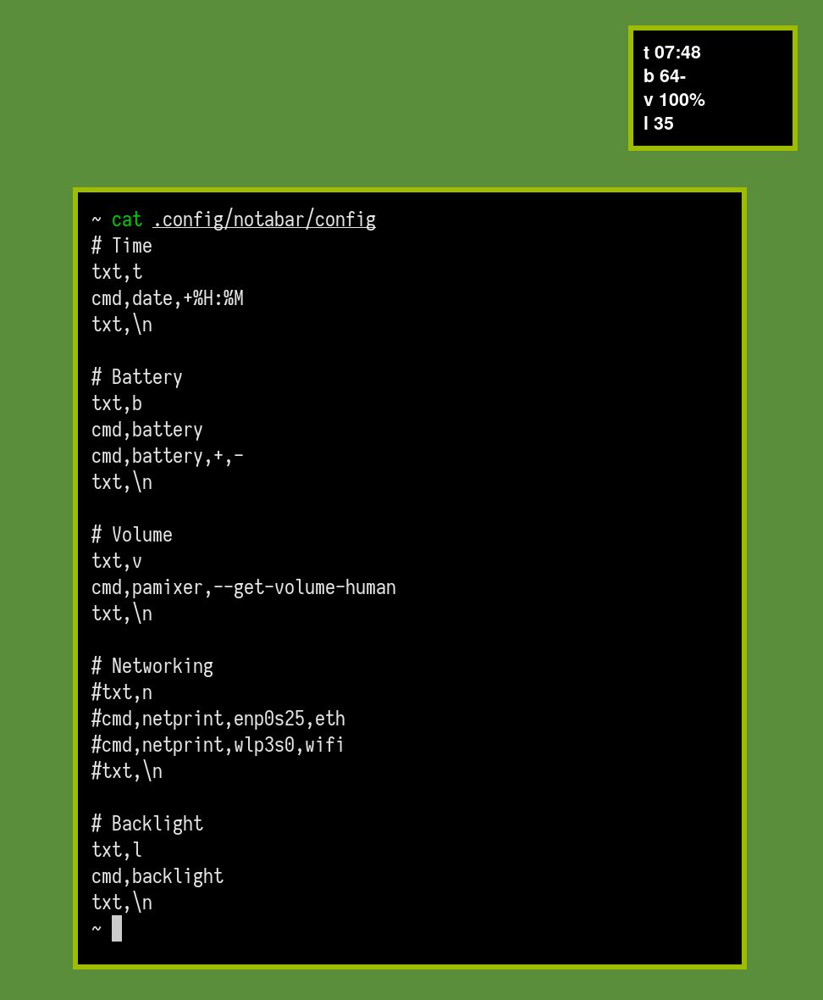

# notabar

Because bars are for noobs.

## Description

Display the output of several programs in a system notification window. This
can be used as a mnml information tool showing time, battery, volume, wifi, and
whatever else you want via simple configuration files and running the program.

More info can be found in `notabar(1)` or for the config in `notabar(5)`

Screenshot of configuration and example notification.

## Build

Build dependencies  

 * golang
 * make
 * sed
 * scdoc

`make all`

## Install

Optionally configure `config.mk` to specify a different install location.  
Defaults to `/usr/local/`

`sudo make install`

## Uninstall

`sudo make uninstall`

## Resources

[Send patches](https://git-send-email.io) and questions to
[~kota/notabar@lists.sr.ht](https://lists.sr.ht/~kota/notabar).

Bugs & todo here: [~kota/notabar](https://todo.sr.ht/~kota/notabar)
